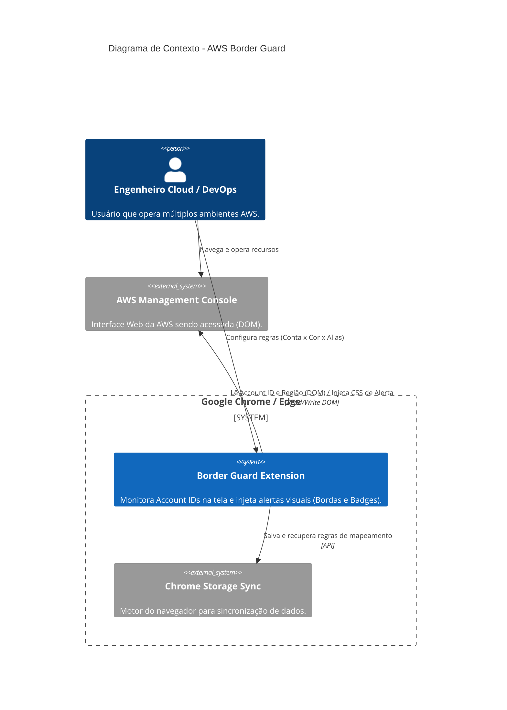
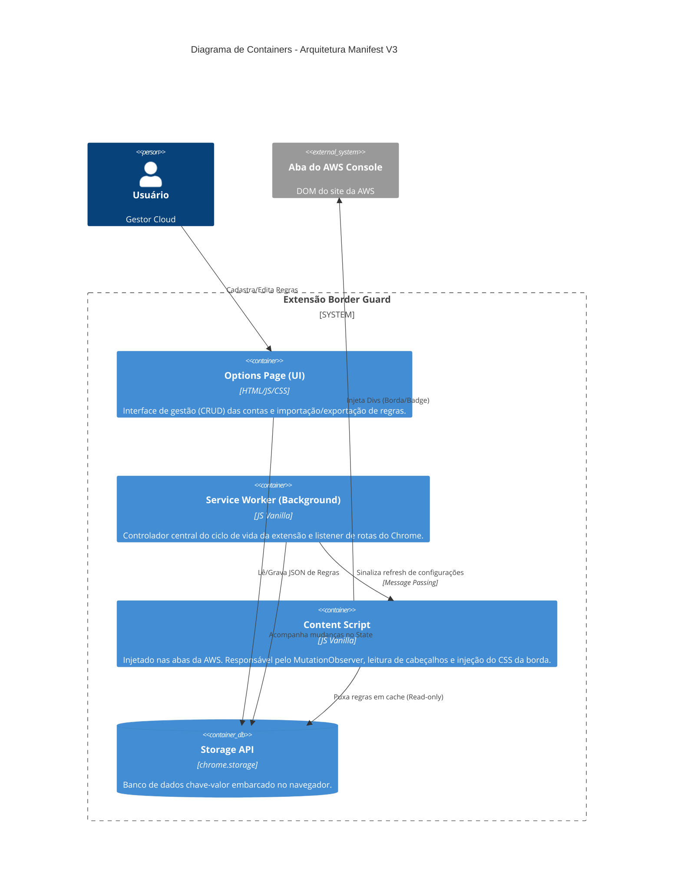

# AWS Environment Border Guard 🛡️ - Arquitetura e Componentes

A arquitetura da solução baseia-se no modelo padrão do **Chrome Extension Manifest V3**, desenhada para ser estrita, segura (Air-gapped) e de altíssima performance visual no navegador do cliente (Client-side puro).

---

## 1. Diagrama de Contexto (C4 Model - Nível 1)
Visão alto nível de como a extensão se posiciona entre o usuário, o navegador e a nuvem da AWS.

---

## 2. Diagrama de Containers (C4 Model - Nível 2)
Detalhamento dos contêineres lógicos que compõem a extensão. Como é uma aplicação puramente front-end embarcada, os "Containers" são os *scripts* vitais do Manifest V3.

## Resumo dos Componentes
- **Options UI:** Tela de configuração separada, aberta pelo usuário quando ele quer alterar algo.
- **Service Worker:** Vive em *background*, inativo na maior parte do tempo. Acorda apenas quando há atualizações de abas (ex: abriu uma nova aba da AWS) ou quando as regras foram alteradas para avisar os Content Scripts ativos.
- **Content Script:** O "motor de execução". Fica acoplado a qualquer URL da AWS (*.console.aws.amazon.com/*). É ele que atua lendo o HTML do site da AWS através do DOM e pinta a tela.
