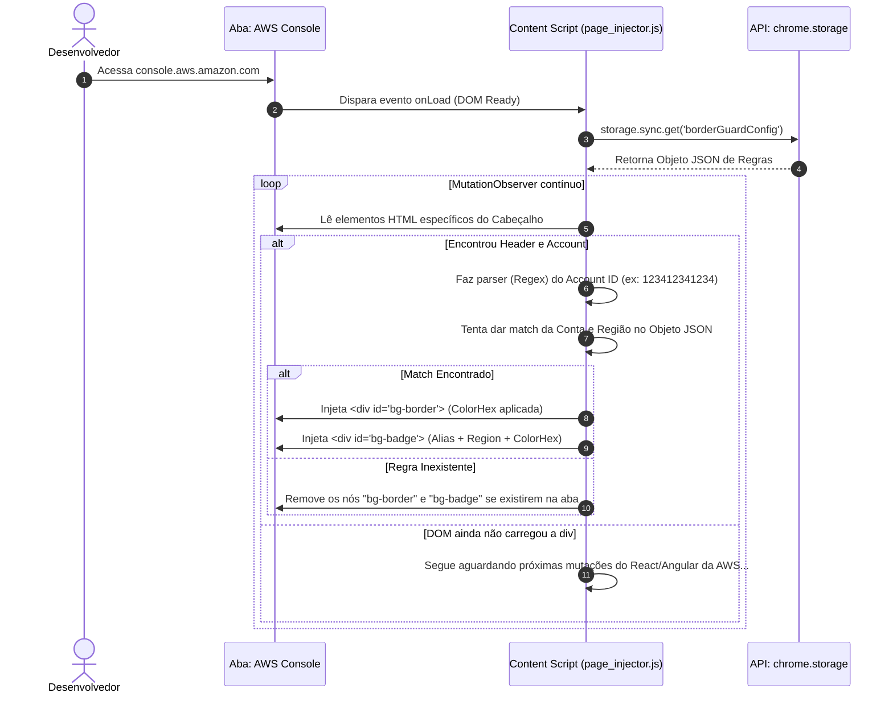

# AWS Environment Border Guard 🛡️ - Diagramas de Sequência

Detalhando a troca de mensagens rigorosa entre os scripts da extensão (Background, Content, e UI) conforme as diretrizes do Manifest V3 do Chrome.

## 1. Sequência: Inicialização e Pintura da Página
O momento exato em que o desenvolvedor entra na AWS e a extensão age para injetar o CSS.



## 2. Sequência: Atualização de Regra com Abas Abertas
Trata o "Edge Case" onde o usuário altera uma cor enquanto está com 5 abas da AWS abertas no fundo e prevê que a cor atualize sem dar F5.

```mermaid
sequenceDiagram
    autonumber
    actor User as Desenvolvedor
    participant Opt as Options UI (HTML)
    participant Chrome as API: chrome.storage
    participant SW as Service Worker (background.js)
    participant CS as Content Script (em múltiplas abas AWS)

    User->>Opt: Muda a cor de uma conta e clica Salvar
    Opt->>Chrome: storage.sync.set()
    Chrome-->>Opt: Sucesso Callback
    Opt-->>User: Exibe toast/notificação de sucesso
    
    Chrome->>SW: Dispara evento 'onChanged'
    SW->>SW: Acorda o worker (Manifest V3 lifecycle constraints)
    
    SW->>Chrome: chrome.tabs.query({url: "*.aws.amazon.com/*"})
    Chrome-->>SW: Retorna lista das abas alvo abertas
    
    loop Para cada aba da AWS
        SW->>CS: chrome.tabs.sendMessage("RELOAD_CONFIGS")
    end
    
    CS->>Chrome: storage.sync.get()
    Chrome-->>CS: Novo JSON com a nova cor
    CS->>CS: Reprocessa e repinta o DOM instantaneamente!
```
