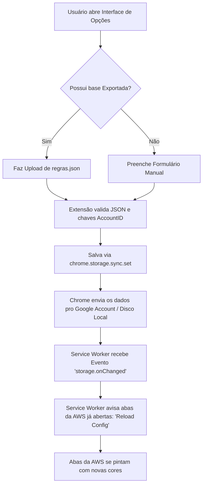
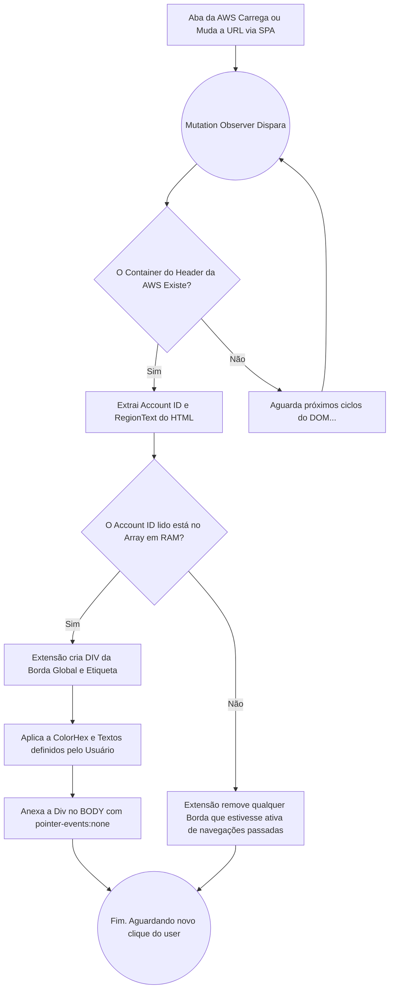

# AWS Environment Border Guard 🛡️ - Fluxos Principais

Visão simplificada dos dois fluxos principais que sustentam a extensão de navegador: o fluxo do usuário gerenciando contas e o fluxo de injeção contínua da página.

## 1. Fluxo de Vida Útil da Extensão e Gerenciamento (Options)
Descreve como o engenheiro usa a UI de configuração para abastecer a base de dados embutida no Chrome.

## 2. Fluxo Principal de Avaliação e Injeção (Content Script vs DOM)
Acontece a cada vez que o Dev entra no Console da AWS ou troca de serviço (já que é SPA). 

