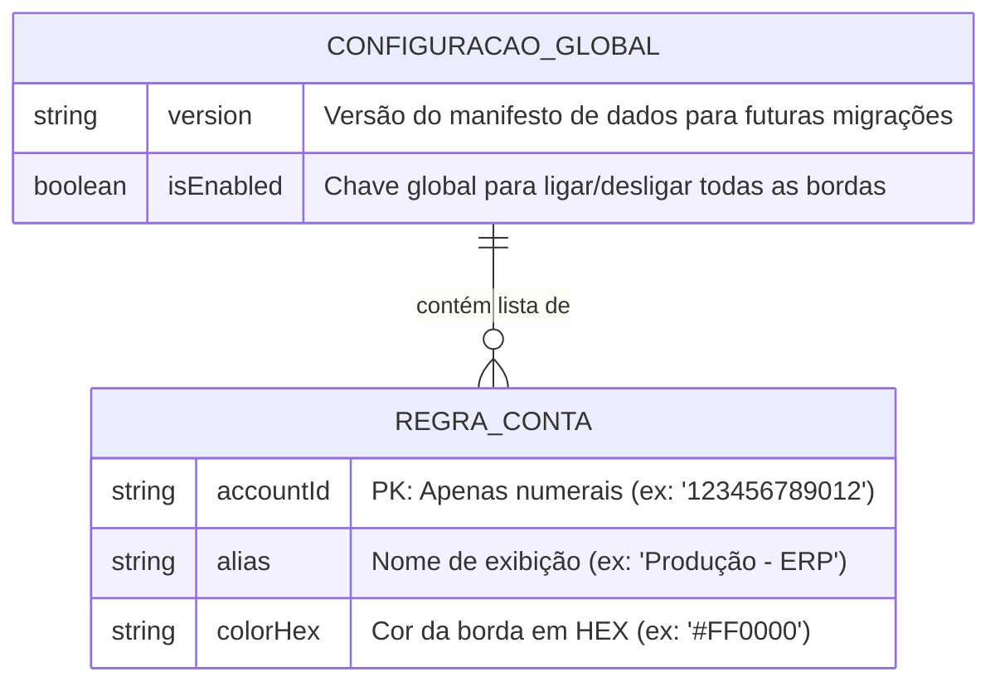

# AWS Environment Border Guard 🛡️ - Modelo de Dados

Por ser uma aplicação leve embarcada no navegador (sem backend de banco de dados SQL/NoSQL clássico), nosso modelo de dados refere-se à estrutura do JSON que trafegará e será salvo na API `chrome.storage.sync`.

## Diagrama da Entidade-Relacionamento (ERD)
A estrutura é flat (uma lista simples de regras para garantir extrema velocidade iterativa no lado do cliente).



## Dicionário de Dados (Amostra do JSON Storage)

O payload salvo no Chrome Storage assumirá o formato abaixo.

```json
{
  "borderGuardConfig": {
    "version": "1.0.0",
    "isEnabled": true,
    "rules": [
      {
        "accountId": "111122223333",
        "alias": "Cliente X - PROD",
        "colorHex": "#E53935"
      },
      {
        "accountId": "444455556666",
        "alias": "Cliente Y - DEV",
        "colorHex": "#43A047"
      }
    ]
  }
}
```

## Limites Físicos (Performance e Capacidade)
- **AccountID** operará como *Primary Key* lógica. Se o usuário na UI tentar incluir uma conta duplicada, a UI fará *upsert* (atualização) da anterior.
- O array `rules` será carregado na memória RAM em tempo de execução (`O(N)`) a cada navegação da AWS. Como combinamos limites via RNFs, uma média de 50~100 regras garantirá tempo de varredura microscópico ( < 1ms).
